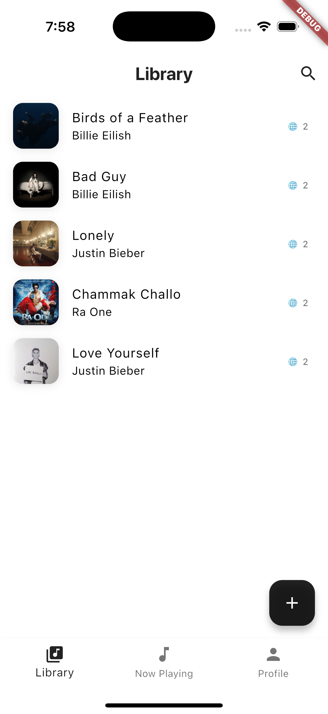
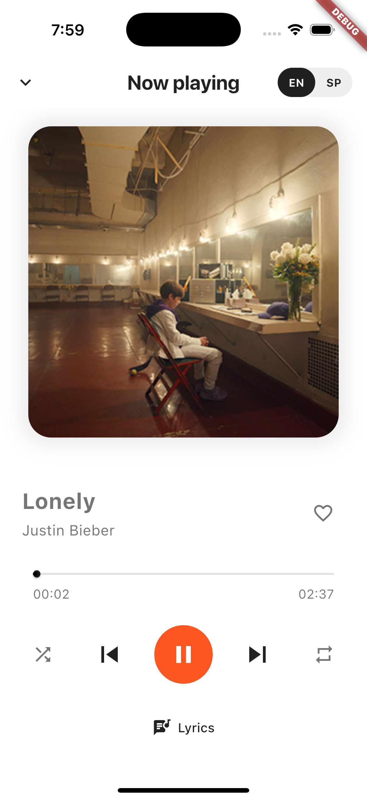
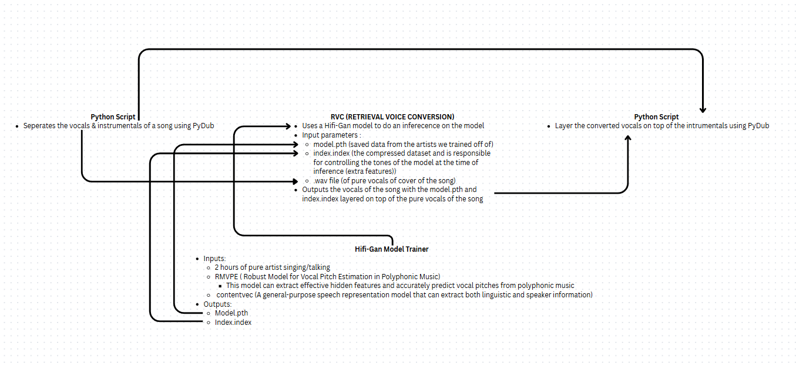

# Global Lyrics

A Flutter application that allows users to listen to songs in multiple languages with synchronized lyrics.

## Features

- Multi-language song playback
- Synchronized lyrics display
- Language switching during playback
- Song library management
- User profile with preferences
- Mini player for background playback
- Like/Dislike functionality
- Shuffle and repeat modes

## Screenshots

### Library Screen


### Current Song Screen


### Profile Screen


### Mini Player


To add your own screenshots:
1. Take screenshots of your application
2. Save them in the `images` directory
3. Name them appropriately (e.g., `library_screen.png`, `current_song_screen.png`, etc.)
4. The images will automatically appear in the README

## How It Works


### Prerequisites

- Flutter SDK (latest stable version)
- Dart SDK (latest stable version)
- Android Studio / VS Code with Flutter extensions
- Git (for version control)

### Installation

1. Clone the repository:
```bash
git clone https://github.com/jimmylieu/globalLyrics.git
```

2. Navigate to the project directory:
```bash
cd globalLyrics
```

3. Install dependencies:
```bash
flutter pub get
```

4. Run the application:
```bash
flutter run
```

## Project Structure

```
lib/
├── main.dart              # Application entry point
├── models/
│   └── song.dart          # Song data model
├── screens/
│   ├── current_song_screen.dart
│   ├── library_screen.dart
│   ├── lyrics_screen.dart
│   └── profile_screen.dart
├── widgets/
│   └── mini_player.dart   # Mini player component
└── repositories/          # Data repositories
```

## Dependencies

- flutter: SDK
- audioplayers: ^latest_version
- [Add other dependencies here]

## Architecture

The application follows a clean architecture pattern with:
- Models: Data structures and business logic
- Screens: UI components and user interaction
- Widgets: Reusable UI components
- Repositories: Data management and API interactions

## Features in Detail

### Multi-language Support
- Songs can be played in different languages
- Lyrics are synchronized with audio playback
- Easy language switching during playback

### Library Management
- Browse and search through song collection
- View song details and album art
- Quick access to recently played songs

### User Profile
- Personal information
- Language preferences
- Song statistics
- Liked songs collection

### Playback Controls
- Play/Pause
- Next/Previous
- Shuffle mode
- Repeat mode
- Progress bar with seek functionality


## License

This project is licensed under the MIT License - see the LICENSE file for details.
